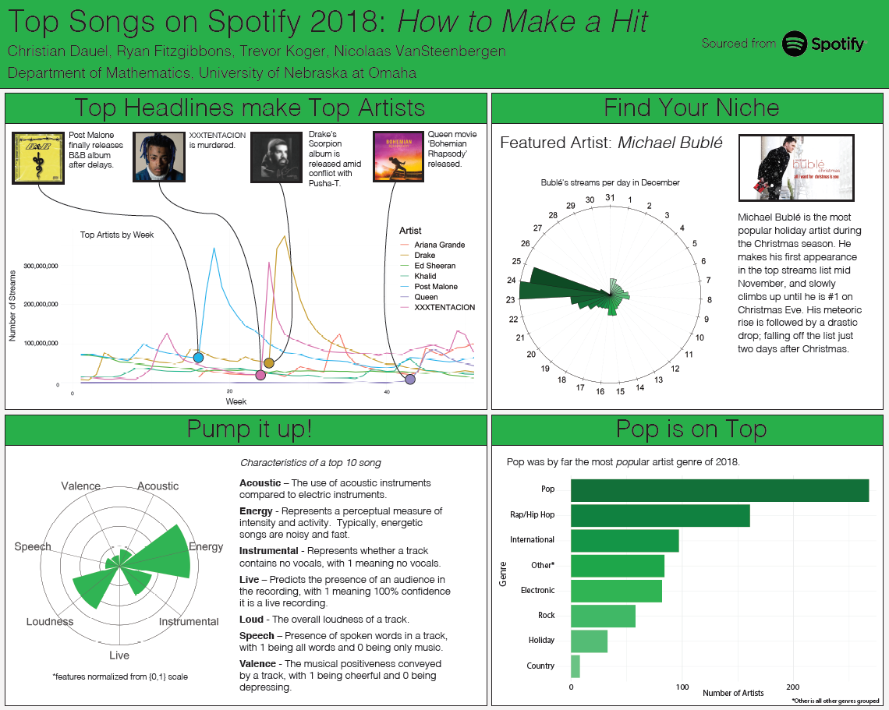

# spotify_project: using the Spotify API to do an analysis on the Top 200

## Project for data visualization course University Nebraska at Omaha

## Contributing Members

Nicolaas VanSteenbergen, Trevor Koger, Christian Dauel, Ryan Fitzgibbons

Data extraction and API calls: Nicolaas VanSteenbergen

Plots: Nicolaas VanSteenbergen, Trevor Koger, Christian Dauel, Ryan Fitzgibbons (all plots rewritten and made more efficient by Nicolaas VanSteenbergen)

## Introduction

Using Spotify's Top 200 charts and the API, we analyze trends and develop interesting insights.

